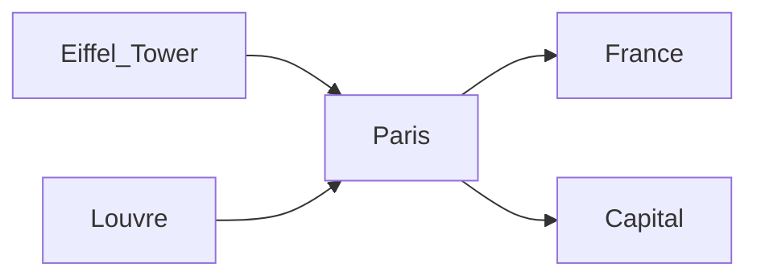

# Graph Visualization

Ariadne's knowledge graph can be exported in multiple formats for visualization and analysis.

## Export Formats

### Graphviz DOT

```python
from arriadne import AriadneMemory
from arriadne.visualization import export_dot

mem = AriadneMemory("my_memory.db")
export_dot(mem, "graph.dot")

# Render to PNG (requires graphviz installed)
# $ dot -Tpng graph.dot -o graph.png
```

### Mermaid Diagram

```python
from arriadne.visualization import export_mermaid

export_mermaid(mem, "graph.mermaid")
```

Output:


### D3.js JSON

```python
from arriadne.visualization import export_json_graph

export_json_mem, "graph.json")
```

Output format:
```json
{
  "nodes": [
    {"id": "Paris", "type": "entity", "degree": 4},
    {"id": "France", "type": "entity", "degree": 1}
  ],
  "links": [
    {"source": "Paris", "target": "France", "type": "related", "weight": 0.8}
  ]
}
```

## Graph Statistics

```python
from arriadne.visualization import get_graph_stats

stats = get_graph_stats(mem)
print(stats)
# {
#   "nodes": 42,
#   "edges": 128,
#   "avg_degree": 6.1,
#   "connected_components": 3,
#   "density": 0.15,
#   "most_connected": "Paris"
# }
```

## REST API

Graph stats are also available via the API:

```bash
GET /api/graph/stats
```
